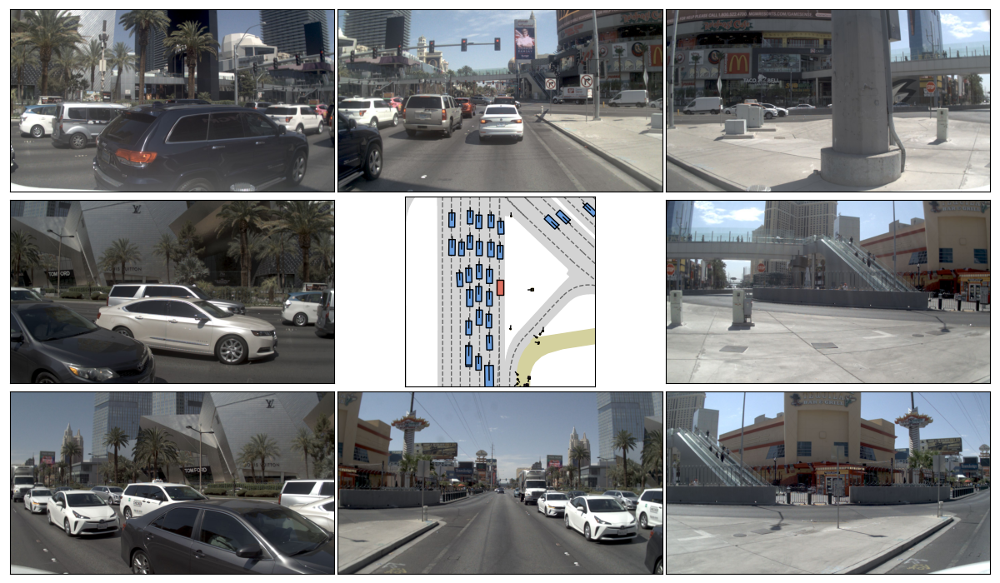
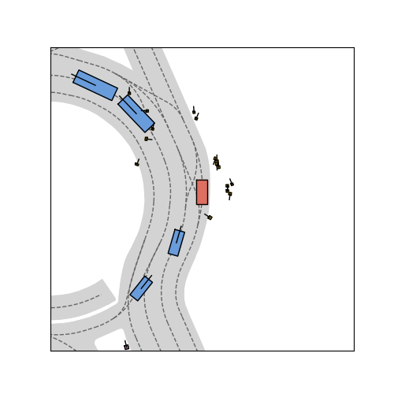
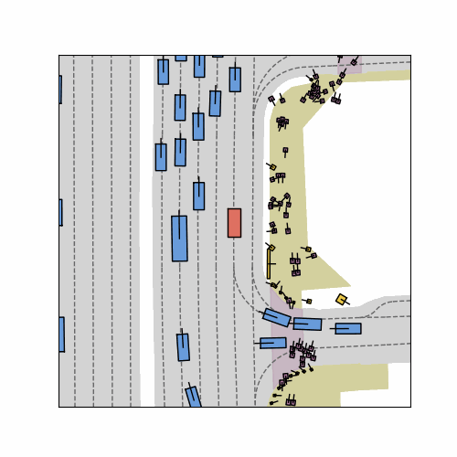

# navsim-helper-functions
Useful helper functions and scripts when doing research on NAVSIM benchmark.

# Usage

Make sure the environment variables are set correctly:

```bash
export CUDA_VISIBLE_DEVICES="0,1,2,3,4,5,6,7"
export PYTHONPATH=/data2/hongxiao_yu/projects/navsimv2
export NUPLAN_MAP_VERSION="nuplan-maps-v1.0"
export NUPLAN_MAPS_ROOT="/data2/hongxiao_yu/projects/navsimv2/dataset/maps"
export NAVSIM_EXP_ROOT="/data2/hongxiao_yu/projects/navsimv2/exp"
export NAVSIM_DEVKIT_ROOT="/data2/hongxiao_yu/projects/navsimv2"
export OPENSCENE_DATA_ROOT="/data2/hongxiao_yu/projects/navsimv2/dataset"
```

Then run the script you want. For example:

```bash
python scene_cameras_bev_viz.py
```

# Scripts List and Results

###### `scene_cameras_bev_viz.py`

The agents in NAVSIM have access to eight cameras surrounding the vehicle. The script shows the cameras in a 3 $\times$ 3 grid with cameras in each direction of the ego-vehicle and the BEV plot in the center. 



###### `scene_bev_viz.py`

The script takes a `Scene` and index of the step to visualize (history or future). 



###### `scene_bev_viz_gif.py`

You can transform frame-wise plots into short animated GIFs. Give any function to `frame_plot_to_gif`, which takes a `Scene` and `frame_idx` as input (ie. `plot_cameras_frame_with_annotations`).



